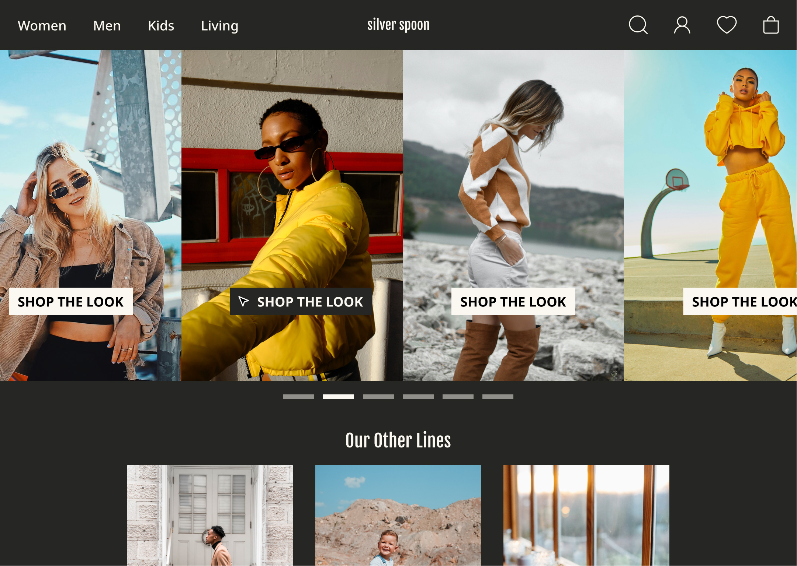

# Ecommerce Fashion Website : 🛍️
- A dynamic website with carousel (slideshow) to capture Users attention to shop the look on the carousel images. The ecommerce fashion website: silverspoon are both user friendly and responsive for all types of devices: desktop, tablet and mobile. 

- If there's more time: make it responsive, make the CTA works & implement the "Our Other Lines" components.

# Built with 🛠️:
- React
- React Bootstrap

# Live Demo:
[Live Demo Link](https://fanciful-dango-6dcd0d.netlify.app/)

## Available Scripts:
In the project directory, you can run:
'npm start'

Runs the app in the development mode.\
Open [http://localhost:3000](http://localhost:3000) to view it in the browser.

The page will reload if you make edits.\
You will also see any lint errors in the console.
'npm test'

# Author:
👩 **Katy Rosli**
- GitHub: [@KatyRosli](https://github.com/KatyRosli)

# Show your support:
Give a ⭐️ if you like this project!

Thank you!

